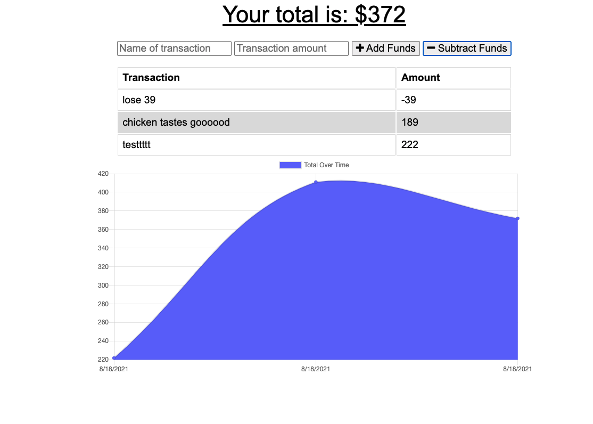

  # MoMoneyMoProblems
  

  ## Description 
    * update an existing budget tracker application to allow for offline access and functionality. The user will be able to add expenses and deposits to their budget with or without a connection. If the user enters transactions offline, the total should be updated when they're brought back online.
  ## Table of Contents (Optional)
  
  * [Installation](#installation)
  * [Usage](#usage)
  * [Credits](#credits)
  * [License](#license)

  ## Installation
    * To install: npm install, after downloading code.
  
  ## Usage 
    * Use this program by: use how you wish

    * Heroku App Located here: https://tranquil-mesa-80725.herokuapp.com/
  
  
  
  
  ## Credits
   * The following folks helped with this project: me
  
  ## License
   * This project uses this license: https://opensource.org/licenses/MIT
  
  ## Badges
  
  * 
  
  ## Features
    * The project has the following features: express, heroku, mongodb
  
  ## Contributing
    * If you'd contribute to this project, consider the following: do, or do not, there is no try. 
  ## Tests
    *nah

  ## Questions?
  * Reach out to the repository owner spectocr, https://github.com/spectocr/MoMoneyMoProblems, or email at highstakes22@gmail.com

